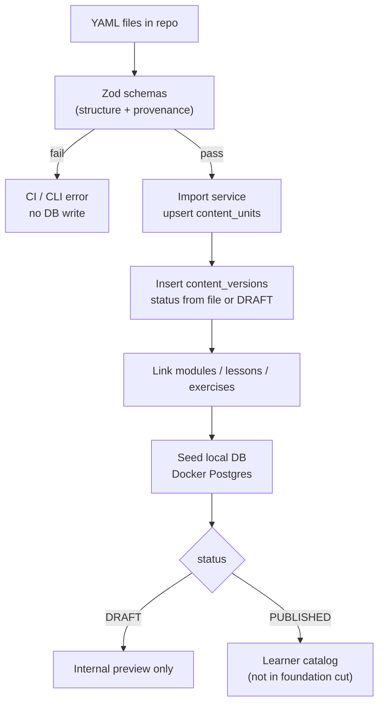

# Content pipeline — SŁOWARIUM

**Статус:** Accepted для V0 / foundation.  
**Форма authoring:** content-as-code (YAML в репозитории), не обязательный CMS ([ADR-004](adr/004-content-as-code.md)).

## 1. Зачем YAML

Требования V0: создать единицу, зафиксировать автора/версию/источники, провести независимый review, опубликовать или отклонить — **без** полноценного authoring cabinet. Git даёт provenance, diff и резервную копию «второй головой».

Человек остаётся автором нормы польского. AI может помочь черновику вне пайплайна публикации; в YAML и БД автор — идентифицируемый человек, не «AI».

## 2. Жизненный цикл версии

Имена статусов foundation (конкретизация `FUN-173` / `CNT-005`):

```text
DRAFT → IN_REVIEW → APPROVED → PUBLISHED
                 ↘ REJECTED → (правки) → DRAFT
PUBLISHED → ARCHIVED
```

| Статус | Кто ставит | Видимость learner | Условие |
| --- | --- | --- | --- |
| **DRAFT** | Author | Нет | Можно preview |
| **IN_REVIEW** | Author (submit) | Нет | Provenance обязателен (`FUN-174`) |
| **APPROVED** | Reviewer ≠ author | Нет | Чеклист + комментарий |
| **PUBLISHED** | Система/admin после APPROVED | Да | Есть reviewer id; событие в `publication_events` |
| **REJECTED** | Reviewer | Нет | Обязательный комментарий; возврат к правкам |
| **ARCHIVED** | Admin/author ops | Нет для новых назначений | История attempts/evidence сохраняется |

Прямой переход `DRAFT → PUBLISHED` **запрещён**.

## 3. Self-review prohibition

Правило `CNT-020` / `FUN-175`:

- `reviewer_user_id` текущей версии **не может** совпадать с `author_user_id` этой версии.
- Техническая проверка на submit approve и на import gate.
- Если независимый reviewer недоступен (DEC-016 Open), единица **остаётся unpublished** — это корректное состояние, не баг процесса.

Документы curriculum/review-packet помогают человеку; они **не** заменяют runtime-запрет self-approve и **не** означают, что A1 уже JPJO-approved.

## 4. Draft preview

- Author/reviewer/admin открывают урок «как учащийся» (`FUN-042`).
- Attempts в режиме `preview` **не** пишут в живой `concept_mastery` учащихся.
- Ключи видны reviewer в preview-инструментах; learner UI ключи до ответа не показывает.
- Модуль **Pierwsze spotkanie**: только DRAFT internal preview на foundation v1.

## 5. Пайплайн: validate → import → seed



### Zod validate

Проверяет минимум:

- `canonical_id`, kind, locale-neutral PL stimuli где нужно;
- provenance: author, originality, sources / «общеизвестный факт»;
- exercise_type + concept refs;
- L1 notes как отдельные ключи `ukr` / `rus` / `bel` без silent fallback;
- запрещённые поля секретов.

### Import

- Идемпотентен по `(canonical_id, version_no)` или content hash.
- Не повышет статус до `PUBLISHED` без review record.
- Пишет `publication_events` при смене статуса.

### Seed

- Локальная и CI-база для e2e/preview.
- Фикстуры без реальных PII.
- *Pierwsze spotkanie* сидится как DRAFT.

## 6. Расположение артефактов (целевое)

| Путь (план) | Назначение |
| --- | --- |
| `content/modules/.../*.yaml` | Учебные единицы |
| `web/src/server/content/schemas` | Zod |
| `web/src/server/content/import` | Import/seed CLI |
| `docs/requirements/curriculum/review-checklist.md` | Человеческий чеклист |
| `docs/reviews/` | Пакеты к JPJO — вне утверждения «уже approved» |

Точные пути могут уточняться при первом PR импорта; контракт статусов и Zod-гейта стабилен.

## 7. Что пайплайн не делает

- Не объявляет Level A1 «полным» или JPJO-approved.
- Не мигрирует и не маркирует A2–B2 как готовые.
- Не копирует официальные exam бланки.
- Не вызывает LLM для publish или итоговой оценки.
