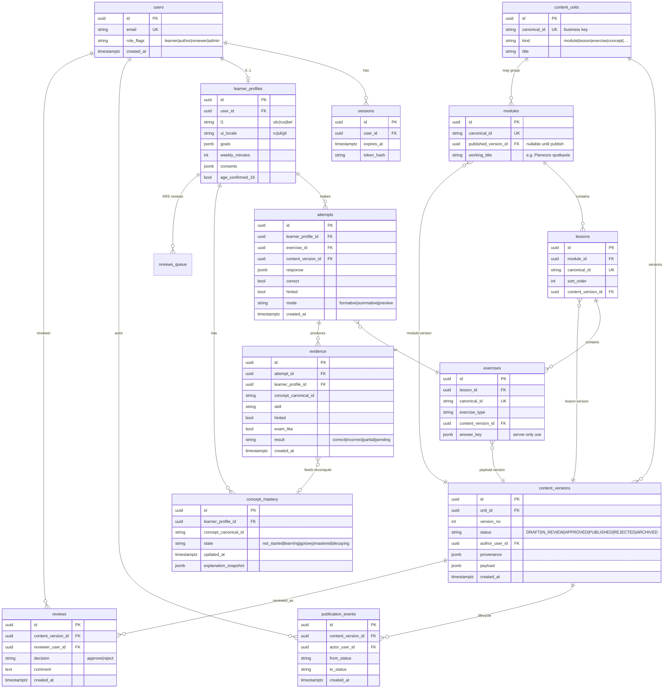

# Модель данных — SŁOWARIUM

**Статус:** Accepted как логическая схема foundation v1.  
**Физическая реализация:** PostgreSQL + Drizzle ([ADR-002](adr/002-postgresql-drizzle.md)).

## 1. Ключевые правила идентификаторов

1. **Технический PK** каждой строки — `UUID` (генерируется в БД или приложении).
2. **Канонические curriculum ID** (`FN-*`, `SCN-*`, `ASM-*`, `EXM-*`, `GR-*`, `LEX-*`, module/lesson slugs вроде будущего `MOD-A1-…`) — **бизнес-ключи**, уникальные в своём пространстве имён. Они стабильны между средами и версиями документации.
3. Свидетельства и попытки ссылаются на **UUID версии контента**, а не только на бизнес-ключ: учащийся всегда привязан к тому тексту/ключу, который видел (`FUN-172`).
4. UI locale и L1 — **разные поля** профиля ([ADR-005](adr/005-i18n-and-l1-separation.md)).

## 2. ERD (логическая)

> `reviews_queue` / таблица SRS-очереди на ERD выше обозначена как `reviews_queue` в связи с learner; в схеме Drizzle имя может быть `spaced_reviews`, чтобы не путать с linguistic `reviews`. Смысл: карточки повторения, выведенные из `concept_mastery` / `evidence`.

## 3. Сущности кратко

### Identity

- **users** — учётная запись Better Auth + флаги ролей (одна персона может иметь несколько ролей).
- **sessions** — серверные сессии; клиент хранит только cookie-токен.

### Profiles

- **learner_profiles.l1** — методика: `ukr` | `rus` | `bel` (отдельные значения; нет «славянский»).
- **learner_profiles.ui_locale** — оболочка: `ru` | `uk` | `pl` (белорусский UI не обязателен).
- Смена UI locale **не** меняет L1 и банк ошибок.

### Content

- **content_units** — стабильная сущность с `canonical_id`.
- **content_versions** — иммутабельный снимок payload + lifecycle status + provenance.
- **modules / lessons / exercises** — учебная иерархия; первый модуль *Pierwsze spotkanie* существует как DRAFT unit/version для internal preview.
- **publication_events** — append-only журнал переходов статусов.
- **reviews** (linguistic) — решение reviewer; `reviewer_user_id ≠ author_user_id` версии.

### Learning outcomes

- **attempts** — сырой ответ; `mode=preview` не влияет на живой mastery.
- **evidence** — нормализованное свидетельство по концепту (`FUN-081`).
- **concept_mastery** — выводимое состояние по правилам `ASM-005` ([ADR-006](adr/006-progress-from-evidence.md)).

## 4. UI locale vs L1

| Поле | Вопрос пользователя | Влияет на |
| --- | --- | --- |
| `ui_locale` | На каком языке кнопки и ошибки UI? | next-intl messages |
| `l1` | Какой родной язык для методики? | L1-заметки, ERR-банк, дистрактор-объяснения |

Объектный польский в упражнениях **не** переводится сменой `ui_locale` (`I18N-003`).

## 5. Что сознательно не моделируем в foundation

- Таблицы голосовых блобов (storage off).
- Биометрические шаблоны.
- Полноценный billing ledger (только задел entitlements later).
- Отдельную graph DB для концептов (граф — данные в payload/связях SQL).

## 6. Миграции

- Схема только через Drizzle migrations.
- Seed: импорт YAML → `content_*` для DRAFT preview.
- Никаких секретов в seed-фикстурах.
