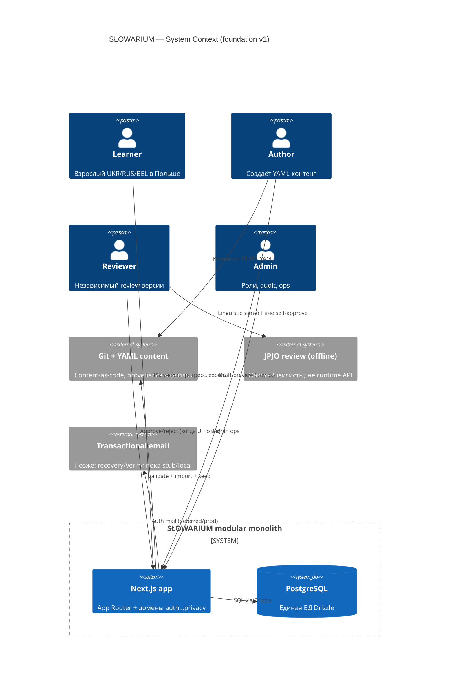
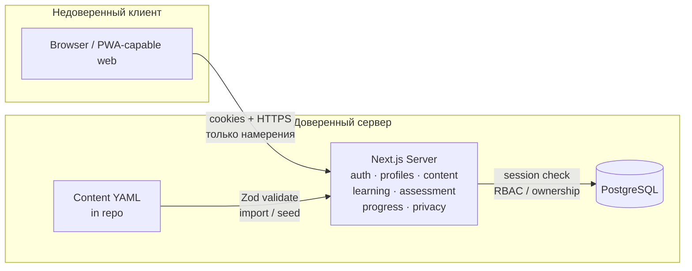

# System context — SŁOWARIUM

**Статус:** Accepted (foundation v1)  
**Форма:** modular monolith в одном Next.js-приложении (`web/`) с доменными модулями и чёткими границами ответственности.

## 1. Зачем monolith

Основатель работает ограниченным временем; публичного launch ещё нет. Микросервисы добавили бы ops-нагрузку без выигрыша в учебном результате. Домены живут **в одном процессе и одной БД**, но код и схема группируются так, чтобы позже можно было вынести модуль без переписывания бизнес-правил.

См. [ADR-001](adr/001-modular-monolith.md).

## 2. Акторы

| Актор | Роль в системе |
| --- | --- |
| Learner | Регистрация, L1/цели, обучение, попытки, просмотр своего прогресса, export/delete |
| Author | Черновики YAML / preview; не может self-approve |
| Reviewer | Независимый linguistic/methodological review (принцип CNT-020; ops-модель JPJO — DEC-016 Open) |
| Admin | Роли, audit, блокировки, очередь публикации; без «тихого» доступа к чужим данным |
| External JPJO reviewer | Человек вне runtime; работает с review-пакетами и чеклистами, не с прод-учениками |

Система **не** является экзаменационным центром и не выдаёт госсертификат.

## 3. Доменные границы

| Домен | Ответственность | Не включает |
| --- | --- | --- |
| **auth** | Сессии, credentials, recovery, роли на учётке | Политика mastery, контент |
| **profiles** | `learner_profiles`: L1, UI locale, цели, бюджет времени, согласия | Свидетельства попыток |
| **content** | Units, versions, modules, lessons, exercises, publication_events | Попытки учащихся |
| **learning** | Назначение следующего шага, показ теории/урока, session UX | Подсчёт mastery |
| **assessment** | Проверка закрытых ключей, коды ошибок, formative feedback | Итоговый human score writing/speaking |
| **progress** | Evidence → concept_mastery → reviews (SRS queue) | Публикация контента |
| **privacy** | Export, delete/anonymize, retention jobs hooks | Authoring workflow |

Правило: **мутации с доверием только на сервере** (Server Actions / route handlers). Клиент рисует UI и отправляет намерения; не решает «зачёт» и не читает чужие UUID.

## 4. C4-ish context

Упрощённый поток данных (без C4-синтаксиса):

## 5. Trust boundary: server vs client

| На клиенте допустимо | Только на сервере |
| --- | --- |
| Рендер UI, локаль next-intl | Создание сессии, смена ролей |
| Ввод ответа упражнения | Проверка ключа, запись `attempts` / `evidence` |
| Показ уже выданного feedback | Пересчёт `concept_mastery` |
| Запрос export/delete | Сборка архива, удаление/анонимизация |
| Draft preview UI (для author/reviewer) | Переход статусов публикации, запрет self-approve |

Горизонтальный доступ (чужой `attemptId` / `learnerId`) обязан давать отказ на сервере (`SEC-004`). Тесты — defensive «чужой id недоступен», без публичных exploit PoC.

## 6. Внутренний preview vs публичный контент

Модуль **Pierwsze spotkanie** на foundation v1:

- статус контента: **DRAFT**;
- доступ: author / reviewer / admin (preview);
- **не** попадает в каталог учащегося как published путь;
- не используется как заявление о готовности A1 или о JPJO-approve.

Учащийся видит только `PUBLISHED` версии. Пока публикаций нет — учебный критический путь в проде отсутствует осознанно.

## 7. Внешние зависимости foundation

- **PostgreSQL** локально через Docker Compose.
- **Better Auth** для сессий (см. security + ADR-003).
- **Transactional email** — контракт заложен, прод-провайдер отложен.
- **Generative AI** — не в критическом пути; флаг off by default.
- **Voice upload** — не в scope foundation (сервер storage off).

## 8. Связь с вертикалями продукта

| Вертикаль | Архитектурный вклад foundation |
| --- | --- |
| V0 content workflow | YAML lifecycle + Zod + import + review gates |
| V1 learner path | auth, profiles, learning, assessment closed items, progress, privacy |
| V2+ | Расширение типов evidence, listening, SRS maturity — без смены формы monolith |
